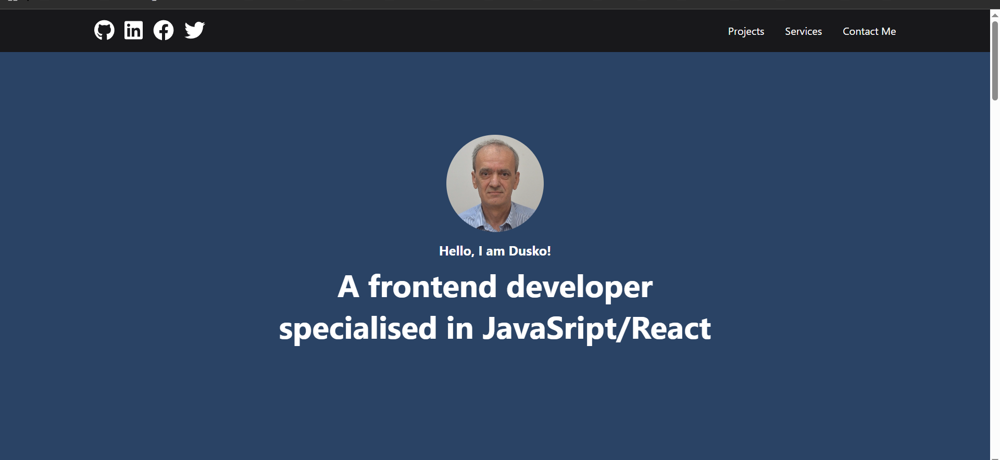

# Portfolio Website – Meta Advanced React Final Project

> This project is a personal portfolio website developed as the final project for the Meta Advanced React Course. It showcases my skills as a frontend developer specializing in JavaScript and React. The website includes the following sections: About, Services, Projects, and Contact.




---

## Live Demo

[View the website on Netlify](https://your-netlify-link.netlify.app)

---

## Technologies Used

- **React 18 (Create React App)**
- **Chakra UI**
- **Formik and Yup**
- **Framer Motion**
- **React Icons / FontAwesome**
- **Context API and Custom Hooks**
- **Jest and React Testing Library**

---

## Project Structure

```
src/
├── components/
├── context/
├── hooks/
├── images/
├── App.js
├── index.js
├── index.css
```

---

## Getting Started

```bash
1. Clone the repository:
   git clone https://github.com/D-vokic/Personal-portfolio-meta.git
   cd Personal-portfolio-meta

2. Install dependencies:
   npm install

3. Run the development server:
   npm start

   The application will be available at `http://localhost:3000`.

4. Build for production:
   npm run build
```

---

## Contact

**Author:** Dusko Vokic  
**Phone:** (+36) 70 434 7540  
**LinkedIn:** [Dusko Vokic](https://www.linkedin.com/in/duskovokic)  
**GitHub:** [Dusko Vokic](https://github.com/D-vokic)

---

## License

This project is open-sourced under the **MIT License** - see the [LICENSE.md](LICENSE.md) file for details.  
© 2025 [Duško Vokić](https://duskovokic.com). Final project for Meta Advanced React Course.
